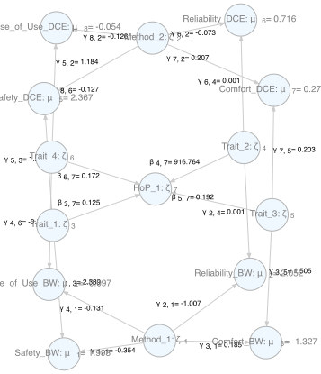

<!-- README.md is generated from README.Rmd. Please edit that file -->

```{r, include = FALSE}
knitr::opts_chunk$set(
  collapse = TRUE,
  comment = "#>",
  fig.path = "man/figures/README-",
  out.width = "100%"
) 
```

# DCM

<!-- badges: start -->
<!-- badges: end -->

The goal of DCM is to ...

## Installation

You can install the development version of DCM from [GitHub](https://github.com/) with:

``` r
# install.packages("devtools")
devtools::install_github("andrewthomasjones/DCM")
```

## Examples

### Basic Models

Load example data
```{r}
library(DCM)
#load test data
processedBW <- setUp(BWpriorities[, 1:8])
```


Set up models of different kinds
```{r BW}
# set up models for best-worst data
m1BW <- modelGenerator(processedBW, "fixed")
m2BW <- modelGenerator(processedBW, "random")
m3BW <- modelGenerator(processedBW, "one-factor")
```

Get estimates
```{r BW2}
#run models for best-worst data
r1BW <- runModel(m1BW)
r2BW <- runModel(m2BW)
r3BW <- runModel(m3BW)

```

Print results for a model
```{r table2}
parPrint(r1BW)
```

### MTMM Models

Join two datasets:

```{r join}
processedDCE <- setUp(DCEpriorities[, 1:7])

processedBW_rem <- removeVariables(processedBW, "Convenience_BW")

combined_data <- joinChoiceDatasets(processedBW_rem, processedDCE)
```

Run MTMM model

```{r mttm, cache=TRUE}
mtmm_model <- modelGenerator(combined_data, "mtmm")

mtmm_results <- runModel(mtmm_model)

```

Print results:

```{r mttm2}
parPrint(mtmm_results)
```

### Graph Output

#### Graph the basic models:

```{r graph1}
library(DiagrammeR)

graph1 <- modelGraph(m2BW)
```

```{r, echo=FALSE, include=FALSE}
export_graph(graph1, "man/figures/graph1.png")
```


```{r graph2}
graph2 <- modelGraph(m2BW)
```

```{r, echo=FALSE, include=FALSE}
export_graph(graph2, "man/figures/graph2.png")
```


```{r graph3}
graph3 <- modelGraph(m3BW)
```


```{r, echo=FALSE, include=FALSE}
export_graph(graph3, "man/figures/graph3.png")
```


#### Graph model estimates:

```{r graph1r}
graph4 <- modelGraph(r1BW)
```

```{r, echo=FALSE, include=FALSE}
export_graph(graph4, "man/figures/graph4.png")
```


```{r graph2r}
graph5 <- modelGraph(r2BW)
```

```{r, echo=FALSE, include=FALSE}
export_graph(graph5, "man/figures/graph5.png")
```


```{r graph3r}
graph6 <- modelGraph(r3BW)
```

```{r, echo=FALSE, include=FALSE}
export_graph(graph6, "man/figures/graph6.png")
```


#### Same with MTMM mode and estimate:

```{r mttm2m}
graph7 <- modelGraph(mtmm_model)
```

```{r, echo=FALSE, include=FALSE}
export_graph(graph7, "man/figures/graph7.png")
```


```{r mttm3r}
graph8 <- modelGraph(mtmm_results)
```

```{r, echo=FALSE, include=FALSE}
export_graph(graph8, "man/figures/graph8.png")
```



