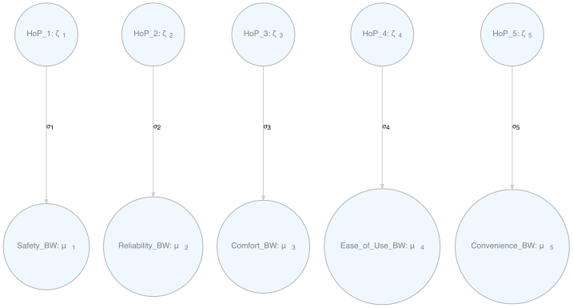
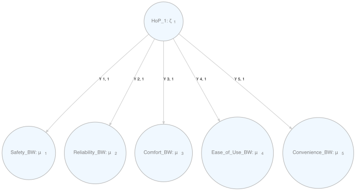
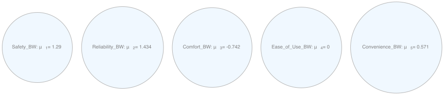
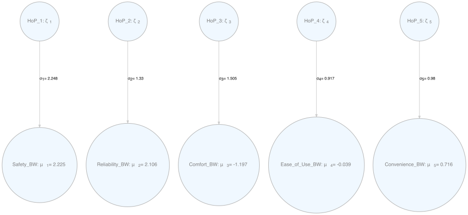

<!-- README.md is generated from README.Rmd. Please edit that file -->

# DCM

<!-- badges: start -->

<!-- badges: end -->

The goal of DCM is to …

## Installation

You can install the development version of DCM from
[GitHub](https://github.com/) with:

``` r
# install.packages("devtools")
devtools::install_github("andrewthomasjones/DCM")
```

## Examples

### Basic Models

Load example data

``` r
library(DCM)
#> Loading required package: foreach
#> 
#> 
#> ###################################################################################
#> #KKKKKKKKK    KKKKKKK     OOOOOOOOO     BBBBBBBBBBBBBBBBB   EEEEEEEEEEEEEEEEEEEEEE#
#> #K:::::::K    K:::::K   OO:::::::::OO   B::::::::::::::::B  E::::::::::::::::::::E#
#> #K:::::::K    K:::::K OO:::::::::::::OO B::::::BBBBBB:::::B E::::::::::::::::::::E#
#> #K:::::::K   K::::::KO:::::::OOO:::::::OBB:::::B     B:::::BEE::::::EEEEEEEEE::::E#
#> #KK::::::K  K:::::KKKO::::::O   O::::::O  B::::B     B:::::B  E:::::E       EEEEEE#
#> #K:::::K K:::::K   O:::::O     O:::::O  B::::B     B:::::B  E:::::E               #
#> #K::::::K:::::K    O:::::O     O:::::O  B::::BBBBBB:::::B   E::::::EEEEEEEEEE     #
#> #K:::::::::::K     O:::::O     O:::::O  B:::::::::::::BB    E:::::::::::::::E     #
#> #K:::::::::::K     O:::::O     O:::::O  B::::BBBBBB:::::B   E:::::::::::::::E     #
#> #K::::::K:::::K    O:::::O     O:::::O  B::::B     B:::::B  E::::::EEEEEEEEEE     #
#> #K:::::K K:::::K   O:::::O     O:::::O  B::::B     B:::::B  E:::::E               #
#> #KK::::::K  K:::::KKKO::::::O   O::::::O  B::::B     B:::::B  E:::::E       EEEEEE#
#> #K:::::::K   K::::::KO:::::::OOO:::::::OBB:::::BBBBBB::::::BEE::::::EEEEEEEE:::::E#
#> #K:::::::K    K:::::K OO:::::::::::::OO B:::::::::::::::::B E::::::::::::::::::::E#
#> #K:::::::K    K:::::K   OO:::::::::OO   B::::::::::::::::B  E::::::::::::::::::::E#
#> #KKKKKKKKK    KKKKKKK     OOOOOOOOO     BBBBBBBBBBBBBBBBB   EEEEEEEEEEEEEEEEEEEEEE#
#> ###################################################################################
#> 
#> version 0.2.0
#> 
#> Type 'citation("DCM")' for citing this R package in publications.
```

``` r
#load test data
processedBW <- setUp(BWpriorities[, 1:8])
```

Set up models of different kinds

``` r
# set up models for best-worst data
m1BW <- modelGenerator(processedBW, "fixed")
m2BW <- modelGenerator(processedBW, "random")
m3BW <- modelGenerator(processedBW, "one-factor")
```

Get estimates

``` r
#run models for best-worst data
r1BW <- runModel(m1BW)
r2BW <- runModel(m2BW)
r3BW <- runModel(m3BW)
```

Print results for a model

``` r
parPrint(r1BW)
#>  [1] "Printout of results for fixed\\\\"              
#>  [2] "Log-likelihood: 13390.9188\\\\"                 
#>  [3] "Number of parameters: 6\\\\"                    
#>  [4] "\\begin{center}"                                
#>  [5] "\\begin{tabular}{lrr}"                          
#>  [6] ""                                               
#>  [7] "Model Parameter & Estimate & Standard Error\\\\"
#>  [8] "\\hline \\\\"                                   
#>  [9] "$\\epsilon_ {\\mu, 1}$&$1.2905$&$0.0377$\\\\"   
#> [10] "$\\epsilon_ {\\mu, 2}$&$1.4343$&$0.037$\\\\"    
#> [11] "$\\epsilon_ {\\mu, 3}$&$-0.7415$&$0.0338$\\\\"  
#> [12] "$\\epsilon_ {\\mu, 4}$&$-3e-04$&$0.0323$\\\\"   
#> [13] "$\\epsilon_ {\\mu, 5}$&$0.571$&$0.0328$\\\\"    
#> [14] "$\\delta_ {\\sigma, 1}$&$1.2905$&$0.0377$\\\\"  
#> [15] "\\end{tabular}"                                 
#> [16] "\\end{center}"
```

### MTMM Models

Join two datasets:

``` r
processedDCE <- setUp(DCEpriorities[, 1:7])

processedBW_rem <- removeVariables(processedBW, "Convenience_BW")

combined_data <- joinChoiceDatasets(processedBW_rem, processedDCE)
```

Run MTMM model

``` r
mtmm_model <- modelGenerator(combined_data, "mtmm")

mtmm_results <- runModel(mtmm_model)
#> Warning in sqrt(diag(solve(loglik1$hessian))): NaNs produced
```

Print results:

``` r
parPrint(mtmm_results)
#>  [1] "Printout of results for \\\\"                   
#>  [2] "Log-likelihood: 16322.1757\\\\"                 
#>  [3] "Number of parameters: 28\\\\"                   
#>  [4] "\\begin{center}"                                
#>  [5] "\\begin{tabular}{lrr}"                          
#>  [6] ""                                               
#>  [7] "Model Parameter & Estimate & Standard Error\\\\"
#>  [8] "\\hline \\\\"                                   
#>  [9] "$\\epsilon_ {\\mu, 1}$&$1.9928$&$0.1345$\\\\"   
#> [10] "$\\epsilon_ {\\mu, 2}$&$2.0516$&$0.0912$\\\\"   
#> [11] "$\\epsilon_ {\\mu, 3}$&$-1.3269$&$0.0907$\\\\"  
#> [12] "$\\epsilon_ {\\mu, 4}$&$-0.097$&$0.0613$\\\\"   
#> [13] "$\\epsilon_ {\\mu, 5}$&$2.3666$&$0.1133$\\\\"   
#> [14] "$\\epsilon_ {\\mu, 6}$&$0.7164$&$0.0608$\\\\"   
#> [15] "$\\epsilon_ {\\mu, 7}$&$0.2745$&$0.0496$\\\\"   
#> [16] "$\\epsilon_ {\\mu, 8}$&$-0.0535$&$0.0466$\\\\"  
#> [17] "$\\gamma_ {1, 1}$&$1.9928$&$0.1345$\\\\"        
#> [18] "$\\gamma_ {1, 3}$&$1.9928$&$0.1345$\\\\"        
#> [19] "$\\gamma_ {2, 1}$&$2.0516$&$0.0912$\\\\"        
#> [20] "$\\gamma_ {2, 4}$&$2.0516$&$0.0912$\\\\"        
#> [21] "$\\gamma_ {3, 1}$&$-1.3269$&$0.0907$\\\\"       
#> [22] "$\\gamma_ {3, 5}$&$-1.3269$&$0.0907$\\\\"       
#> [23] "$\\gamma_ {4, 1}$&$-0.097$&$0.0613$\\\\"        
#> [24] "$\\gamma_ {4, 6}$&$-0.097$&$0.0613$\\\\"        
#> [25] "$\\gamma_ {5, 2}$&$2.3666$&$0.1133$\\\\"        
#> [26] "$\\gamma_ {5, 3}$&$2.3666$&$0.1133$\\\\"        
#> [27] "$\\gamma_ {6, 2}$&$0.7164$&$0.0608$\\\\"        
#> [28] "$\\gamma_ {6, 4}$&$0.7164$&$0.0608$\\\\"        
#> [29] "$\\gamma_ {7, 2}$&$0.2745$&$0.0496$\\\\"        
#> [30] "$\\gamma_ {7, 5}$&$0.2745$&$0.0496$\\\\"        
#> [31] "$\\gamma_ {8, 2}$&$-0.0535$&$0.0466$\\\\"       
#> [32] "$\\gamma_ {8, 6}$&$-0.0535$&$0.0466$\\\\"       
#> [33] "$\\beta_ {3, 7}$&$-1.3269$&$0.0907$\\\\"        
#> [34] "$\\beta_ {4, 7}$&$-0.097$&$0.0613$\\\\"         
#> [35] "$\\beta_ {5, 7}$&$2.3666$&$0.1133$\\\\"         
#> [36] "$\\beta_ {6, 7}$&$0.7164$&$0.0608$\\\\"         
#> [37] "\\end{tabular}"                                 
#> [38] "\\end{center}"
```

### Graph Output

#### Graph the basic models:

``` r
library(DiagrammeR)

graph1 <- modelGraph(m2BW)
```



``` r
graph2 <- modelGraph(m2BW)
```


``` r
graph3 <- modelGraph(m3BW)
```



#### Graph model estimates:

``` r
graph4 <- modelGraph(r1BW)
```



``` r
graph5 <- modelGraph(r2BW)
```



``` r
graph6 <- modelGraph(r3BW)
```


#### Same with MTMM mode and estimate:

``` r
graph7 <- modelGraph(mtmm_model)
```


``` r
graph8 <- modelGraph(mtmm_results)
```


